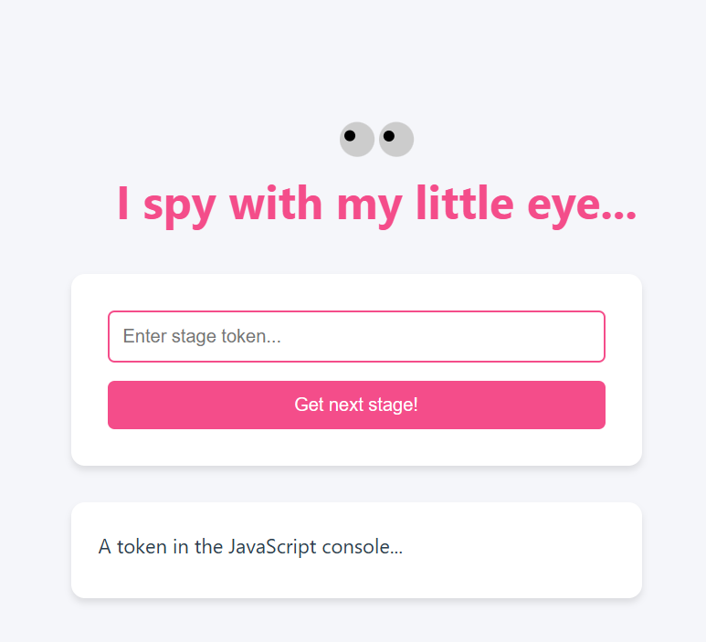
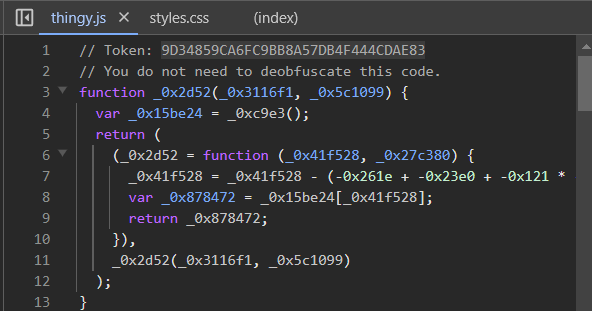
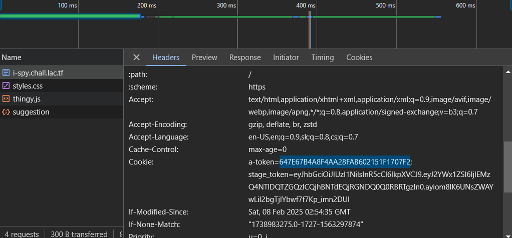
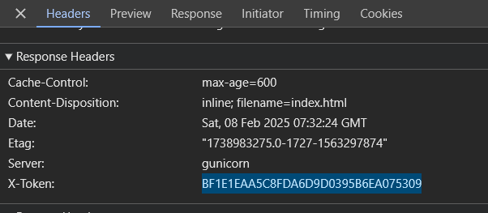
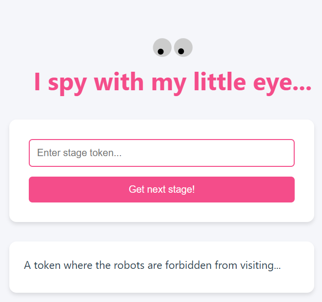
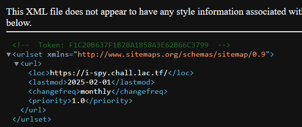

Token in header
Token in stylesheets
Javascript console
HTML code
Cookie

A token where the robots are forbidden from visiting...

`User-agent: *
Disallow: /a-magical-token.txt`

3FB4C9545A6189DE5DE446D60F82B3AF

A token where Google is told what pages to visit and index...
https://i-spy.chall.lac.tf/sitemap.xml

A token received when making a DELETE request to this page...
curl -X DELETE https://i-spy.chall.lac.tf/
You DELETED MY WEBSITE!!!!! HOW DARE YOU????? 32BFBAEB91EFF980842D9FA19477A42E

A token in a TXT record at i-spy.chall.lac.tf...

metju@swagbook:~/lactf25$ nslookup -type=TXT i-spy.chall.lac.tf
Server:         10.255.255.254
Address:        10.255.255.254#53

Non-authoritative answer:
i-spy.chall.lac.tf      text = "Token: 7227E8A26FC305B891065FE0A1D4B7D4"

Authoritative answers can be found from:
